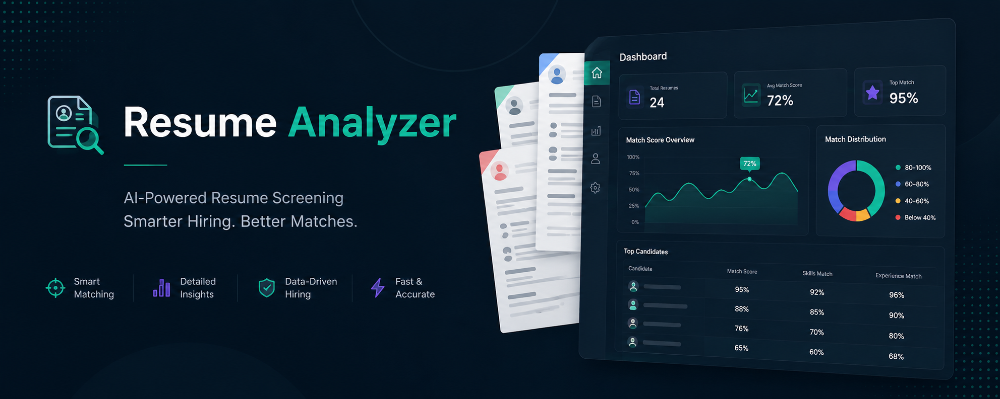
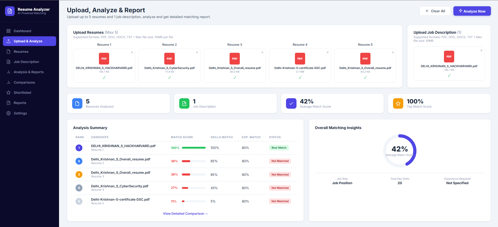
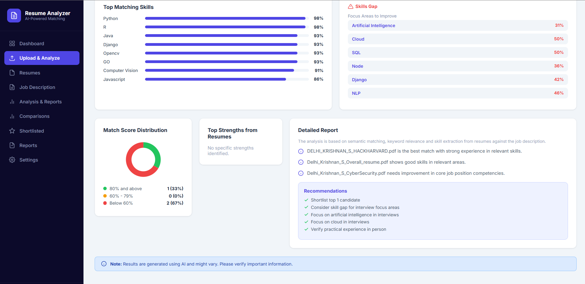

# 🤖 AI Resume Screening Portal

[](https://www.python.org/)
[](https://www.djangoproject.com/)
[](https://www.sbert.net/)
[](.)
[](SECURITY.md)

> **AI-powered resume screening system using Sentence-BERT for semantic resume–job description matching**

Fine-tuned an AI-powered resume screening system that uses Sentence-BERT for semantic similarity, paired with a Django backend featuring document parsing, keyword extraction, candidate ranking, and RESTful workflows. Implemented secure file upload validation, input sanitisation, and a modular Django architecture.

---

## 📸 Screenshots


### Analysis Results & Candidate Ranking


---

## ✨ Key Features

### 🧠 AI & NLP
- **Sentence-BERT Semantic Matching** — Bidirectional cosine similarity between resume and job description sentences using `all-mpnet-base-v2` (768-dimensional embeddings)
- **DistilBERT Classification** — Secondary scoring model (`Poojan11/resume-screening-distilbert`) for classification-based match confidence
- **Weighted Ensemble Scoring** — 60% SBERT similarity + 40% DistilBERT classification for robust final scores
- **Smart Keyword Extraction** — NLP-powered skill identification using NLTK POS tagging + domain-specific tech keyword matching
- **Per-Skill Scoring** — Individual match scores for each technical skill found in the job description
- **Skills Gap Analysis** — Automatically identifies missing skills and areas to improve

### 📄 Document Processing
- **Multi-format Support** — PDF (PyMuPDF), DOCX (python-docx), TXT, and image OCR (pytesseract)
- **Intelligent Text Extraction** — Filters relevant content (skills, projects, experience) from raw text
- **Job Role Detection** — Automatically extracts job title, experience requirements, and key skills from JDs

### 📊 Dashboard & Analytics
- **Modern Dashboard UI** — Professional interface with sidebar navigation, upload areas, and comprehensive results
- **Candidate Ranking Table** — Side-by-side comparison with Match Score, Skills Match, Experience Match, and Status badges
- **Circular Progress Charts** — Visual average match score with SVG-based circular progress indicators
- **Donut Distribution Chart** — Match score distribution visualization
- **Detailed Reports** — AI-generated insights and actionable recommendations per candidate
- **Drag & Drop Upload** — Intuitive file upload with type validation and file preview cards

### 🔒 Security
- **CSRF Protection** — Enabled on all POST endpoints
- **File Sanitisation** — Prevents path traversal attacks (`../../etc/passwd`)
- **Input Validation** — File type, size (10MB limit), and content verification
- **Secure Headers** — HSTS, X-Frame-Options, Content-Type-Options
- **No Default Secrets** — `SECRET_KEY` must be explicitly configured via `.env`
- **Security Logging** — Separate rotating log for security events

### 🏗️ Clean Architecture
- **Separation of Concerns** — Views (HTTP) → Services (AI/ML) → Utils (file processing)
- **RESTful API** — JSON endpoints for enhanced analysis (`/api/analyze/`)
- **Modular Design** — Independent, testable modules with clear interfaces
- **31+ Test Cases** — Comprehensive coverage for utilities, services, views, and security

---

## 🚀 Quick Start

### Prerequisites
- Python 3.10+
- pip
- 2GB+ RAM (for ML models)

### Installation

```bash
# 1. Clone the repository
git clone https://github.com/YOUR_USERNAME/Resume-Screening-Portal.git
cd Resume-Screening-Portal

# 2. Create virtual environment
python -m venv venv
source venv/bin/activate      # Linux/Mac
venv\Scripts\activate         # Windows

# 3. Install dependencies
pip install -r requirements.txt

# 4. Download spaCy model
python -m spacy download en_core_web_sm

# 5. Download NLTK data
python -c "import nltk; nltk.download('stopwords'); nltk.download('punkt'); nltk.download('averaged_perceptron_tagger')"

# 6. Setup environment
cp .env.example .env
python -c "from django.core.management.utils import get_random_secret_key; print(get_random_secret_key())"
# Paste the generated key into .env as SECRET_KEY=<your-key>

# 7. Run migrations
python manage.py migrate

# 8. Start the server
python manage.py runserver

# 9. Open in browser
# http://localhost:8000
```

---

## 📖 How It Works

### Workflow
```
Upload Resumes + JD  →  Extract Text  →  Sentence-BERT Encoding
                                              ↓
                                     Bidirectional Cosine Similarity
                                              ↓
                              DistilBERT Classification (optional)
                                              ↓
                              Weighted Ensemble Score (0-100%)
                                              ↓
                     Keyword Extraction  +  Skills Gap Analysis
                                              ↓
                           Ranked Results + Detailed Report
```

### Scoring Algorithm
```python
# Bidirectional Sentence-BERT Similarity
resume_to_jd = max_cosine_sim(resume_sentences, jd_sentences)  # per sentence
jd_to_resume = max_cosine_sim(jd_sentences, resume_sentences)
sbert_score = mean(resume_to_jd + jd_to_resume) / 2

# DistilBERT Classification
distilbert_score = softmax(model(resume + jd))['match_probability']

# Final Weighted Score
final_score = (sbert_score * 0.6) + (distilbert_score * 0.4)
```
### Upload & Analyze Dashboard

---

## 🛠️ Tech Stack

| Layer | Technology | Purpose |
|-------|-----------|---------|
| **Web Framework** | Django 4.2 | HTTP handling, templates, routing |
| **Semantic Matching** | Sentence-Transformers (SBERT) | 768-dim embeddings, cosine similarity |
| **Classification** | DistilBERT (HuggingFace) | Resume-JD match classification |
| **NLP** | spaCy, NLTK | Sentence segmentation, keyword extraction |
| **PDF Parsing** | PyMuPDF (fitz) | Text extraction from PDFs |
| **DOCX Parsing** | python-docx | Text extraction from Word documents |
| **OCR** | pytesseract + Pillow | Text extraction from images |
| **Database** | SQLite | Django default storage |
| **Frontend** | Vanilla JS + CSS | Modern dashboard with SVG charts |

---

## 🔗 API Endpoints

### Modern Dashboard (default)
```http
GET /
```
Renders the full-featured dashboard with upload, analysis, and reporting.

### Enhanced Analysis API
```http
POST /api/analyze/
Content-Type: multipart/form-data

Parameters:
  - jd: Job description file (required)
  - resume1-5: Up to 5 resume files

Response:
{
  "success": true,
  "job_role": "Software Engineer",
  "experience_required": "3-5 Years",
  "total_jd_skills": 15,
  "results": [
    {
      "resume_name": "candidate.pdf",
      "score": 85.5,
      "sbert_score": 82.3,
      "distilbert_score": 90.2,
      "skills_match": 73.3,
      "experience_match": 88,
      "matched_keywords": ["python", "django", "rest", "api"],
      "missing_keywords": ["kubernetes", "docker"],
      "skill_scores": {"Python": 92, "Django": 86, ...},
      "status": "Best Match",
      "match_report": [...]
    }
  ],
  "top_strengths": ["Python", "Django", ...],
  "insights": ["Candidate A is the best match..."],
  "recommendations": ["Shortlist top 2 candidates", ...],
  "score_distribution": {"above_80": 2, "between_60_79": 1, "below_60": 1}
}
```

### Legacy Endpoints
```http
GET  /legacy/          # Original multi-upload form
POST /multi-match/     # Original analysis endpoint
```

---

## 🎓 Training Your Own Model

### Generate Dataset → Train → Deploy
```bash
# Install training dependencies
pip install -r requirements-training.txt

# Generate synthetic training data
python generate_dataset.py --positive 100 --negative 100 --samples

# Visualise dataset statistics
python visualize_dataset.py

# Fine-tune Sentence-BERT
python train_model.py --epochs 4 --batch-size 16

# Model saved to: output/job_bert_finetuned/
# Update services.py to point to your fine-tuned model
```

See [TRAINING_GUIDE.md](TRAINING_GUIDE.md) for detailed instructions.

---

## 📁 Project Structure

```
Resume-Screening-Portal/
├── analysis/                    # Main Django app
│   ├── views.py                # HTTP handlers + API endpoints
│   ├── services.py             # AI/ML business logic (SBERT, DistilBERT)
│   ├── utils.py                # File processing, validation, sanitisation
│   ├── tests.py                # 31+ comprehensive test cases
│   ├── urls.py                 # URL routing
│   └── templates/analysis/
│       ├── dashboard.html      # Modern dashboard UI ★
│       ├── multi_upload.html   # Legacy upload form
│       └── upload.html         # Single resume form
├── resume_analyzer/            # Django project settings
│   ├── settings.py             # Security-hardened configuration
│   └── urls.py                 # Root URL routing
├── generate_dataset.py         # Synthetic training data generator
├── train_model.py              # SBERT fine-tuning script
├── visualize_dataset.py        # Dataset visualisation
├── demo_training.py            # Training pipeline demo
├── screenshots/                # UI screenshots for README
├── .env.example                # Environment template
├── requirements.txt            # Production dependencies
├── requirements-training.txt   # Training dependencies
├── SECURITY.md                 # Security documentation
├── TRAINING_GUIDE.md           # Model training guide
└── TRAINING_QUICKREF.md        # Quick reference card
```

---

## 🔒 Security & Testing

### Run Tests
```bash
# All tests
python manage.py test

# Specific suites
python manage.py test analysis.tests.SecurityTestCase
python manage.py test analysis.tests.UtilsTestCase
python manage.py test analysis.tests.ServicesTestCase

# With coverage
pip install coverage
coverage run --source='.' manage.py test
coverage report
```

See [SECURITY.md](SECURITY.md) for full security documentation.

---

## 🔧 Configuration

Create a `.env` file from the template:
```bash
cp .env.example .env
```

Key settings:
```env
SECRET_KEY=your-generated-secret-key
DEBUG=True
ALLOWED_HOSTS=localhost,127.0.0.1
MAX_FILE_SIZE=10485760
LOG_LEVEL=INFO
```

---

## 🚨 Troubleshooting

| Issue | Solution |
|-------|----------|
| Model download slow | First run downloads ~420MB SBERT model. Ensure stable internet. |
| NLTK data missing | `python -m nltk.downloader stopwords punkt averaged_perceptron_tagger` |
| File upload fails | Check file is PDF/DOCX/TXT and under 10MB |
| SECRET_KEY error | Copy `.env.example` to `.env` and generate a key |
| spaCy model missing | `python -m spacy download en_core_web_sm` |

---

## 🚀 Future Enhancements

- [ ] User authentication & authorisation
- [ ] Database storage for analysis history
- [ ] Batch processing with Celery background tasks
- [ ] Export results to PDF/CSV
- [ ] REST API with Django REST Framework
- [ ] Redis caching for embeddings
- [ ] Dashboard with analytics trends

---

**Built with Django + Sentence-BERT + DistilBERT**

*Core AI matching • Security hardened • Comprehensive testing • Training pipeline*
